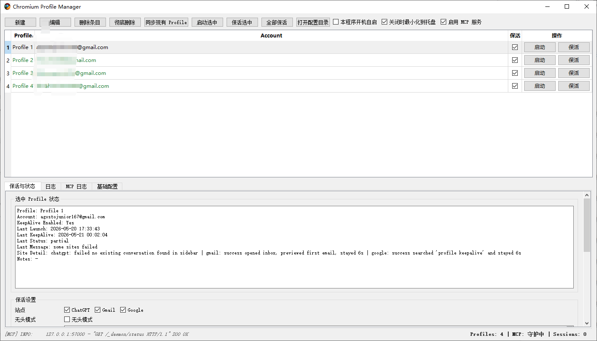

# MCP Chromium Advanced

MCP Chromium Advanced is a desktop GUI and MCP service for managing real Chromium browser profiles. It is intended for workflows that need an existing logged-in browser identity rather than a fresh automation-only browser.

[中文文档](./README_zh.md)

## Overview

This project is best understood as a real Chromium identity manager plus an MCP browser service. Instead of creating a fresh disposable automation browser for every task, it is designed to let AI workflows safely reuse existing logged-in browser profiles.

From a first-contact perspective, there are seven key ideas:

1. It solves the "real login state" problem.
   The project lets GUI-managed Chromium profiles be exposed to MCP clients so automation can reuse cookies, local storage, extensions, bookmarks, and site permissions.
2. It is organized into layered runtime control.
   The GUI manages configuration and profiles, the daemon provides a stable MCP endpoint, the worker starts on demand, and a managed browser session kernel normalizes runtime behavior before MCP tools use it.
3. It supports multiple browser execution engines.
   Shared profile and session ownership stay the same, while the execution backend can use Selenium plus `undetected_chromedriver`, Patchright, or `playwright_cli`.
4. It exposes a more stable runtime contract than the raw engines alone.
   The managed session kernel adds structured capability metadata, normalized action errors, and generic DOM-script fallbacks so callers are less exposed to engine-specific gaps.
5. It is designed around safe profile ownership.
   Session checks prevent live-root tasks, threads, or keepalive jobs from silently fighting over the same logged-in browser identity, while mirror-isolated runtime clones provide a controlled parallel path when enabled.
6. It attaches automation to real Chromium profiles.
   The browser is launched with the actual `user-data-dir` and `profile-directory`, then the selected execution engine connects to that persistent profile.
7. It includes keepalive workflows in addition to MCP control.
   The GUI can run scheduled or manual keepalive tasks against real logged-in profiles for sites such as ChatGPT, Gmail, and Google.

Important account boundary: a Chromium `Profile N` is a browser data container, not a universal website account. The GUI `Account` field is an operator-maintained label or note and should be treated as a hint only. Each website still has its own login state inside that browser profile, so account-sensitive automation must verify the actual logged-in account on the target site before continuing.

The public user entry point is:

```bash
python run_gui.py
```

## Screenshot



## How it works

The browser automation layer supports:

- Selenium: [https://www.selenium.dev/](https://www.selenium.dev/)
- undetected-chromedriver: [https://github.com/ultrafunkamsterdam/undetected-chromedriver](https://github.com/ultrafunkamsterdam/undetected-chromedriver)
- Patchright: [https://github.com/Kaliiiiiiiiii-Vinyzu/patchright](https://github.com/Kaliiiiiiiiii-Vinyzu/patchright)
- Playwright CLI: [https://github.com/microsoft/playwright-cli](https://github.com/microsoft/playwright-cli)

The project starts Chromium with a real `user-data-dir` and `profile-directory`, then attaches the selected browser engine to that profile. This allows the worker to reuse real cookies, sessions, local storage, extensions, and other persistent browser state.

If you use a fingerprint plugin, the project can also load `my-fingerprint`:

- my-fingerprint releases: [https://github.com/omegaee/my-fingerprint/releases](https://github.com/omegaee/my-fingerprint/releases)

On top of that browser layer, the MCP service adds:

- profile/session occupancy checks
- session start and release APIs
- a stable daemon endpoint with a lazy-start worker
- GUI-based lifecycle control and logs

## Main capabilities

- Manage multiple Chromium profiles from one GUI
- Expose real browser identities to MCP clients
- Prevent conflicting sessions across threads or tasks
- Switch the default browser engine in the GUI configuration
- Expose structured runtime capabilities instead of only raw engine names
- Normalize action failures into stable error codes for callers
- Start the browser worker only when needed
- Release resources automatically after idle timeout
- Run keepalive jobs against real logged-in profiles
- Coordinate multi-tab browser work with explicit tab listing, opening, activation, and closing tools
- Collect structured console, page error, and network diagnostics instead of relying on screenshots alone
- Fall back to generic DOM-based snapshot, candidate enumeration, wait, and target diagnostics when a runtime lacks native support

## Engine selection

The project now treats browser engines as execution strategies under one shared profile/session governance model.

There are two ways to choose an engine:

- GUI default engine
  Stored in `app.browser_engine`. This is the fallback engine used when MCP callers do not pass an explicit engine.
- Per-request explicit engine
  MCP callers may pass `engine` to `can_start_profile_session(...)` and `start_profile_session(...)`.

Recommended practical policy:

- `playwright_cli`
  Default choice for normal MCP work. Fast startup, lower interaction overhead, and good fit for `mirror_isolated` parallel sessions.
- `selenium_uc`
  Preferred for stealth-sensitive sites or workflows where avoiding automation detection matters more than raw throughput.
- `patchright`
  Preferred for complex frontend diagnosis, richer structured debugging, and the strongest snapshot/tab-aware inspection behavior.

Important switching rule:

- Changing the GUI default engine affects only future sessions.
- Existing sessions keep the engine they were started with.
- `reuse_existing=true` only reuses a compatible session for the same profile and the same engine.
- In `mirror_isolated` mode, starting a new session with a different engine creates a new isolated runtime; it does not hot-switch an existing session in place.

## Requirements

- Python 3.10+
- A local Chromium-compatible browser
- A matching ChromeDriver build
- A desktop environment

For AI-assisted setup after cloning, use the dedicated runbook:

- [AI Installation Runbook](./docs/AI_INSTALLATION_RUNBOOK.md)

Install dependencies:

```bash
pip install -r requirements.txt
```

## Browser and driver setup

You need three local resources before using the tool:

1. A Chromium or Chrome binary
2. A matching `chromedriver`
3. A persistent user data directory

Common choices:

- ungoogled-chromium
- Chromium
- Google Chrome

The ChromeDriver version should match the browser major version as closely as possible.

### Strong recommendation

This project strongly recommends `ungoogled-chromium`.

- It is more stable for long-lived local automation setups
- It does not auto-update aggressively, which helps avoid unexpected ChromeDriver breakage
- Versions below `136` are recommended because newer releases may have compatibility issues with `ungoogled-chromium` in some environments

Official download pages:

- ungoogled-chromium binaries: [https://ungoogled-software.github.io/ungoogled-chromium-binaries/](https://ungoogled-software.github.io/ungoogled-chromium-binaries/)
- Chrome for Testing / ChromeDriver: [https://googlechromelabs.github.io/chrome-for-testing/](https://googlechromelabs.github.io/chrome-for-testing/)

Driver matching rule:

- Always match the Chromium major version with the ChromeDriver major version
- If the default download page does not show the exact build you need, adjust the version number in the driver download URL until it matches your installed Chromium version
- Before wiring paths into the GUI, verify the browser version and driver version are aligned

## Configuration

At first launch, the app creates a config file in the platform config directory:

- Windows: `%APPDATA%/ChromiumProfileManager/workstates/chromium_profiles.json`
- macOS: `~/Library/Application Support/ChromiumProfileManager/workstates/chromium_profiles.json`
- Linux: `${XDG_CONFIG_HOME:-~/.config}/ChromiumProfileManager/workstates/chromium_profiles.json`

A sanitized template is included in the repository:

- `chromium_profiles.example.json`
- `resources/bookmarks_template.html`

On first run, the app copies the bundled bookmark template into the local workspace default path if no template exists yet.

Important fields:

- `paths.chromium_dir`
  Path to the browser executable, or a directory containing it
- `paths.chromedriver_path`
  Path to `chromedriver`, or a directory containing it
- `paths.user_data_root`
  Root directory that stores all persistent browser profiles
- `paths.mirror_user_data_root`
  Root directory used for mirror snapshots and extracted isolated runtime clones
- `paths.bookmarks_template_path`
  Optional bookmark template used when initializing profiles
- `paths.fingerprint_zip_path`
  Optional path related to `my-fingerprint`
- `app.language`
  UI language code such as `en`, `ja`, or `zh`
- `app.browser_engine`
  Default browser execution backend, currently `selenium_uc`, `patchright`, or `playwright_cli`
- `app.concurrency_mode`
  Session governance mode: `block` keeps the historical single-live-root rule, while `mirror_isolated` allows parallel sessions by starting from mirror snapshots when available
- `launch.*`
  Browser launch defaults used by the built-in Python launcher, such as `new_window`, `start_maximized`, `load_fingerprint_extension`, `check_url`, and `extra_args`
- `mcp.host`, `mcp.port`, `mcp.worker_port`, `mcp.path`
  Network settings for the daemon and worker

### Mirror-isolated concurrency

The project now supports an optional snapshot-based concurrency model for real-profile work:

- `block`
  Historical behavior. Any live Chromium root usage blocks new sessions.
- `mirror_isolated`
  The SessionManager prefers launching from a mirror snapshot stored under `paths.mirror_user_data_root`, so concurrent work can run against extracted runtime clones instead of the live `user_data_root`.

Important rules:

- Keepalive and mirror refresh remain exclusive operations.
- Mirror snapshots are refreshed after keepalive completes successfully.
- Same-profile parallelism means independent extracted runtime clones, not multiple engines sharing the same live profile directory at once.
- If no valid mirror snapshot exists and no other browser session is active, startup falls back to the live root. If another session is already active, startup is blocked until a mirror is available.

## MCP service

When enabled in the GUI, the daemon exposes a stable HTTP endpoint such as:

```text
http://127.0.0.1:28888/mcp
```

The daemon stays available between tasks. The browser worker is started only when a request needs it, and it is reclaimed after the configured idle timeout.

Operational notes:

- The daemon is intended to stay stable while the worker is short-lived and lazily started.
- A worker reclaimed because of `idle_timeout` is a normal managed lifecycle event, not a crash.
- If the configured Chromium binary root already has live browser processes, session startup is intentionally blocked with states such as `external_chromium_running`.
- That busy-state rule applies before engine startup when the session would touch the live root, including `playwright_cli`.
- In `mirror_isolated` mode, `external_chromium_running` no longer blocks snapshot-backed starts if a valid mirror is available.
- MCP tools publish standard tool annotations so clients can distinguish trusted local/browser operations from arbitrary script execution.
- These annotations reduce unnecessary approval prompts in clients that honor MCP hints, but they do not bypass the client approval policy or this project's profile/busy-state governance.
- Normal profile/session operations, navigation, tab operations, clicking, typing, key presses, mouse actions, screenshots, diagnostics, and cleanup are treated as trusted low-risk MCP operations for local real-profile workflows. `run_script` remains non-read-only because arbitrary JavaScript is the highest-risk browser action.

Typical MCP flow:

1. `list_profiles`
2. `get_server_status`
3. `get_profile_status(profile_name)`
4. `can_start_profile_session(profile_name)`
5. `start_profile_session(profile_name)`
6. perform browser actions
7. `close_profile_session(session_id)`

Engine-aware callers may also pass an explicit engine when starting a session. If omitted, the configured GUI default engine is used.

For example:

```text
can_start_profile_session(profile_name="Profile 4", engine="selenium_uc")
start_profile_session(profile_name="Profile 4", engine="playwright_cli")
```

### Multi-tab tools

The worker now exposes formal multi-tab operations so agents do not have to rely on hidden browser focus changes:

- `browser_list_tabs`
- `browser_open_tab`
- `browser_activate_tab`
- `browser_close_tab`

The practical workflow is:

1. open or discover the tab
2. activate the target tab explicitly
3. perform page actions on that active tab
4. switch again when needed

For tab-aware read and debug calls, tools such as `navigate`, `get_current_url`, `get_page_text`, `get_page_html`, `browser_snapshot`, `browser_list_candidates`, `inspect_elements`, `run_script`, and `screenshot` also accept an optional `tab_id`.

### Debug and observability tools

The worker also exposes structured debugging helpers that are meant to replace manual F12 screenshots in many cases:

- `browser_get_console_messages`
- `browser_get_page_errors`
- `browser_get_network_requests`
- `browser_clear_debug_buffers`
- `browser_diagnose_page`
- `browser_get_action_trace`
- `get_mcp_tool_trace`

`browser_diagnose_page` is the highest-signal first stop when an agent gets blocked. It bundles the current interaction context together with recent console errors, page exceptions, failed requests, and recent bad HTTP responses. Heavy `playwright_cli` diagnostics are bounded by short CLI timeouts and truncated raw output so a noisy site should return a partial diagnosis instead of blocking the MCP worker for minutes.

`browser_get_action_trace` reports recent managed browser actions for one session, including slow actions, failures, fallback usage, and average duration. `get_mcp_tool_trace` reports MCP worker-level tool timings so real production calls can be inspected without digging through Codex internal logs. The MCP trace is also written to a JSONL file shown in the GUI MCP status panel and is rotated automatically to avoid unbounded log growth.

## Engine Notes

### Shared behavior

- Profile creation, deletion, syncing, bookmarks, and session ownership are shared across all engines
- GUI and MCP session flow stay the same regardless of engine
- Real `user-data-dir` plus `profile-directory` remain the source of truth

### Selenium plus undetected-chromedriver

- Currently the most mature path in the project
- Also powers the existing keepalive workflows
- Uses the shared `launch.*` defaults for direct profile launch
- Best current stealth-oriented option in the project
- Still the code-level fallback default if no configured engine is present

### Patchright

- Already supports real persistent profile sessions through the MCP/session layer
- Uses a smaller validated startup argument set than Selenium for compatibility
- Intended for sites where a Playwright-compatible execution model is more reliable
- Provides the strongest tab model and the richest structured debug telemetry in the current project
- Collects DevTools-style diagnostics through per-tab CDP sessions, so agents can read console output, uncaught exceptions, and network failures without opening browser DevTools manually
- Keepalive is not routed through Patchright yet in this stage

### Playwright CLI

- Current preferred engine for normal MCP task execution on this machine when the GUI default is set to `playwright_cli`
- Best fit for lower-overhead task execution and snapshot-backed parallel work in `mirror_isolated` mode
- Native stealth is weaker than `selenium_uc`
- Native inspection fidelity is weaker than `patchright`, but the managed runtime lifts it with fallbacks, diagnostics, and structured recovery metadata
- Added as a third parallel engine under the same `SessionManager -> BrowserEngine factory` path
- Uses `playwright-cli open --persistent` only for startup, then reuses the named session for later commands
- Reuses the real `user-data-dir` together with Chromium `--profile-directory=Profile N`, so logged-in state can be preserved
- Supports the validated first-stage surface: session start, navigation, multi-tab basics, script execution, type/click/key actions, screenshot, console, requests, and coarse page diagnostics
- Managed runtime fallbacks lift the raw CLI session with generic `snapshot`, candidate enumeration, waiting, target verification, and snapshot-ref style targeting where possible
- Uses a fast DOM eval path for simple selector `click` and `fill` operations, then falls back to native `playwright-cli` commands if the DOM path is not safe or fails
- Classifies console and network noise into categories such as third-party, asset, media, security policy, CORS, and auth, so diagnostics can separate useful signal from common site noise
- Sanitizes the upstream `playwright-cli` Chromium launch args so `AutomationControlled` is not injected through `--disable-blink-features`
- Honors `mcp.start_minimized=true` by default, so visible MCP browser sessions start minimized in the taskbar instead of stealing desktop focus while still allowing the user to click in and take over when needed
- Keeps `mcp.headless=false` by default; headless mode is only for explicit user-requested regression or background validation, not the normal MCP browsing path
- On session close, the runtime attempts to terminate owned `playwright-cli` daemon and Chromium processes and then cleans isolated runtime directories; startup also prunes stale empty or old `chromium-advanced-playwright-cli-*` temp directories that are not referenced by live processes
- Shared-root concurrency still does not work: one real `user_data_root` can only back one live browser session at a time, so the existing busy-state governance remains mandatory
- Keepalive is not routed through `playwright_cli` in this stage
- Windows packaged GUI, daemon, and worker executables have been validated against the managed runtime path

### Selenium plus undetected-chromedriver debug notes

- Selenium sessions now expose the same high-level tab and debug tools where Chromium logging supports them
- Console and network diagnostics are gathered from browser and performance logs, so they are best-effort compared with Patchright
- Structured accessibility snapshots and snapshot-ref targeting still remain Patchright-only

## Cross-platform notes

This is a Python project and the source code is being kept platform-aware.

- Windows is the primary tested platform
- macOS and Linux are supported at source level when valid browser and driver paths are provided
- Windows packaging is currently the most complete desktop packaging path

## Skill templates

The repository includes reusable agent skill templates in:

- `docs/skill_templates/`

These files are examples for Codex or other AI workflows that need to consume this MCP service consistently. They are templates, not an auto-loaded runtime directory.

## Keepalive Plugins

Keepalive sites use a plugin-style runtime. Built-in site logic exists for `chatgpt`, `google`, `gmail`, and `github`; custom Python plugins can add new site IDs such as `youtube` or `youtube_studio` without rebuilding the app. The desktop GUI now includes a dedicated Keepalive Plugins tab for browsing built-in plugin source, creating external plugins, and editing trusted local plugin code. Additional trusted plugin directories can still be configured in the GUI keepalive settings or in `keepalive.plugin_dirs`.

- [Keepalive Plugin Guide](./docs/KEEPALIVE_PLUGIN_GUIDE.md)

Typical usage:

1. Copy the appropriate `.SKILL.md` file into your global or project-specific skill directory
2. Adjust host, port, and profile naming rules if your environment differs
3. In other AI tasks, instruct the agent to use that skill when interacting with this MCP service

## Privacy and security

- Do not commit your real `chromium_profiles.json`
- Do not commit real profile data, cookies, session state, or personal account labels
- Do not expose the MCP endpoint to untrusted networks
- Agents should never guess a real profile identity; they should ask or use an explicit `profile_name`

Bookmark templates themselves are not treated as sensitive by default and can be kept in the repository if they are generic.

## Repository structure

- `run_gui.py`
  Public entry point
- `chromium_advanced/chromium_manage_gui.py`
  Desktop GUI
- `chromium_advanced/mcp_daemon.py`
  Stable daemon service
- `chromium_advanced/mcp_server.py`
  Browser worker implementation
- `docs/ARCHITECTURE_GUIDE.md`
  Additional implementation notes
- `docs/skill_templates/`
  Reusable agent skill templates for Codex or other AI workflows, including Windows and WSL examples
- `resources/bookmarks_template.html`
  Bookmark template bundled with the project

## License

This project is licensed under the MIT License. See [LICENSE](./LICENSE).
