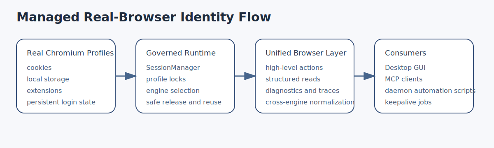
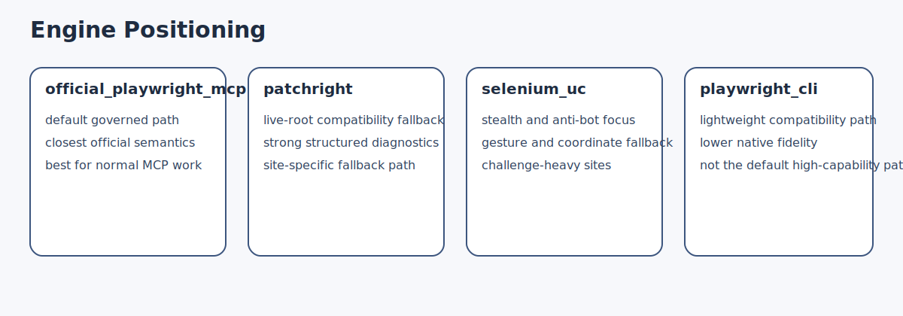

# MCP Chromium Advanced

Managed real-browser identities for AI automation.

MCP Chromium Advanced is a desktop GUI plus MCP service for workflows that must
reuse a real Chromium profile with persistent login state instead of starting a
fresh disposable automation browser every time.

Current release baseline: `0.1.0`

- [中文说明](./README_zh.md)
- [Documentation Index](./docs/README.md)



## What It Is

This project combines:

- a desktop GUI for managing real Chromium profiles
- a stable daemon and worker runtime
- an MCP browser service for agents
- a governed daemon automation API for fixed local scripts

The core idea is simple:

- one `Profile N` is one browser identity container
- all consumers must acquire that identity through one governance layer
- browser work can then reuse real cookies, local storage, extensions, and site login state

## Why It Exists

Most browser automation tools are optimized for disposable sessions.

This project is optimized for:

- persistent site login state
- explicit profile ownership
- real local browser data
- safe reuse across GUI, MCP, keepalive, and script automation

Important account boundary:

- a Chromium `Profile N` is not a universal website account
- the GUI `Account` field is only an operator note
- account-sensitive automation must verify the logged-in account on the target site before continuing

## Main Value

- Reuse real logged-in Chromium profiles
- Expose those identities to MCP clients safely
- Keep profile ownership explicit and conflict-free
- Support multiple browser engines behind one managed interface
- Provide structured diagnostics, traces, and normalized action results
- Support fixed-script automation through daemon APIs, not only MCP
- Run keepalive jobs against selected logged-in profiles

## Engine Positioning



Supported engines:

- `official_playwright_mcp`
  default governed high-level path and the preferred engine for ordinary MCP work
- `patchright`
  live-root compatibility fallback when a site behaves better on the older direct integration
- `selenium_uc`
  preferred for stealth, challenge-heavy, gesture, drag, or coordinate-sensitive work
- `playwright_cli`
  lightweight compatibility path, not the default high-capability path

## User Entry Points

Source entry:

```bash
python run_gui.py
```

Typical packaged Windows entry:

```text
<install_root>\ChromiumProfileManager.exe
```

Default local MCP endpoint:

```text
http://127.0.0.1:28888/mcp
```

## Typical Flows

### 1. GUI + MCP

```text
GUI / Agent
-> daemon / worker
-> SessionManager
-> selected engine
-> real Chromium profile
```

### 2. Fixed Script + daemon automation

```text
Local script
-> /_daemon/automation/*
-> SessionManager
-> selected engine
-> real Chromium profile
```

### 3. Keepalive

```text
GUI / scheduler
-> keepalive runtime
-> profile-scoped lock
-> site check / refresh
-> status writeback
```

## Security Model

The project separates control access from browser-work access.

- `mcp.api_token`
  for MCP clients and normal daemon automation calls
- `control.api_token`
  for GUI/control routes such as dashboard, logs, keepalive, plugin management, and worker control

Rules:

- no localhost bypass
- MCP token cannot call `/_control/*`
- control token cannot call `/mcp`
- profile governance is not bypassed to reduce approvals or friction

## What The Managed Layer Adds

Callers do not talk to raw engines directly. The managed layer adds:

- normalized action results
- unified high-level browser tools
- structured reads and candidate ranking
- diagnostics and traces
- session health and recovery hints
- cross-engine fallback behavior where appropriate

This is what lets engines stay independent while callers still see one coherent browser tool surface.

## Current Boundaries

- The project intentionally stays generic and open. It does not ship site-specific DOM adapters for Gmail, YouTube Studio, GitHub, or other individual targets.
- On difficult dynamic frontends, the strongest validation surface is still the higher-level structured path such as `structured_page`, `browser_list_candidates(...)`, `browser_get_interaction_context(...)`, screenshots, and traces.
- `run_script(...)` can still legitimately return `result=null` on healthy pages. Treat that as a runtime readback boundary, not automatic proof that the page is broken.
- If a task depends on very high-fidelity structured extraction, prefer the default `official_playwright_mcp` path or explicit `patchright`.

## Documentation

Start here:

- [Documentation Index](./docs/README.md)
- [AI Installation Runbook](./docs/01-getting-started/AI_INSTALLATION_RUNBOOK.md)
- [Architecture Guide](./docs/02-architecture/ARCHITECTURE_GUIDE.md)
- [System Architecture Overview](./docs/02-architecture/SYSTEM_ARCHITECTURE_OVERVIEW.md)
- [Daemon Automation Integration](./docs/03-integrations/DAEMON_AUTOMATION_INTEGRATION.md)
- [Keepalive Plugin Guide](./docs/03-integrations/KEEPALIVE_PLUGIN_GUIDE.md)
- [Browser Core Validation Playbook](./docs/04-operations/BROWSER_CORE_VALIDATION_PLAYBOOK.md)
- [Skill Templates](./docs/skill_templates/)

## Screenshot


## Repository Structure

- `run_gui.py`
  source entrypoint
- `chromium_advanced/chromium_manage_gui.py`
  desktop GUI
- `chromium_advanced/mcp_daemon.py`
  stable daemon service
- `chromium_advanced/mcp_server.py`
  browser worker implementation
- `chromium_advanced/session_manager.py`
  profile/session governance
- `chromium_advanced/browser_session_kernel.py`
  managed capability unification
- `docs/`
  user, integration, operations, architecture, and reference documentation

## License

This project is licensed under the MIT License. See [LICENSE](./LICENSE).
