# Chromium Advanced 系统架构图

这份文档给出当前项目的全景架构图，覆盖：

- GUI 控制面
- daemon / worker / MCP 服务面
- daemon automation API
- `SessionManager` 治理层
- 四套浏览器引擎
- keepalive 插件运行时
- 外部固定脚本接入
- 配置、日志、Profile UserData 存储

说明：

- VS Code 的 Mermaid 预览在当前环境下不稳定，下面主图改为静态 SVG。
- 如果需要再维护 Mermaid 版本，建议单独放到附录，不作为主阅读路径。

## 1. 系统总览

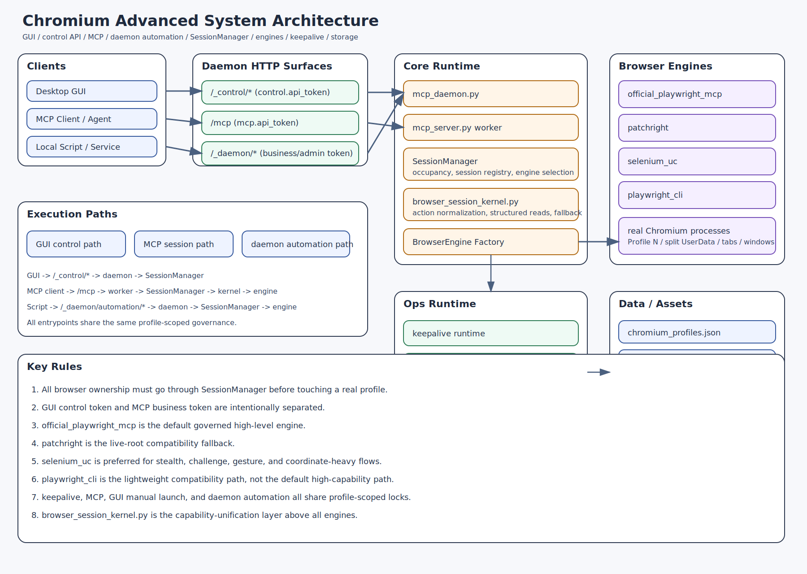

对应含义：

- `Desktop GUI`：桌面图形入口
- `Control Plane`：GUI 通过 `/_control/*` 访问的控制面
- `Service Plane`：MCP 与 daemon automation 的业务面
- `Core Runtime`：daemon、worker、会话治理、能力归一化
- `Browser Engines`：四套浏览器引擎
- `Ops Runtime`：keepalive、浏览器扩展装载、日志
- `Data / Local Assets`：配置、UserData、运行时资源、本地资产

补充语义：
- `UserDataProfile*`：正式持久层，保存长期登录态与用户数据
- `mirror_disk`：镜像层，用于生成受治理运行副本
- `runtime`：临时执行层，用于 `official_playwright_mcp` 等隔离运行时，会后应清理

## 2. 控制面与业务面分层

当前系统不是单一入口，而是三套面：

- GUI 控制面
- MCP 业务面
- daemon automation 业务面

控制面下当前已稳定的核心命名空间包括：

- `/_control/profiles/*`
- `/_control/keepalive/*`
- `/_control/keepalive/sites*`
- `/_control/extensions*`
- `/_control/log-settings`

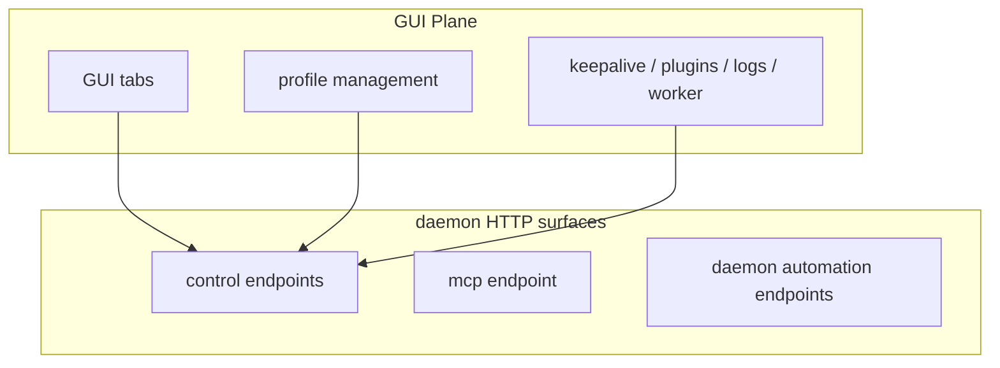

token 边界：

- `control.api_token`：只给 GUI / control API
- `mcp.api_token`：只给 MCP 与普通 daemon automation
- admin token：只给高权限 daemon 管理动作

## 3. GUI 到 daemon 的控制链路

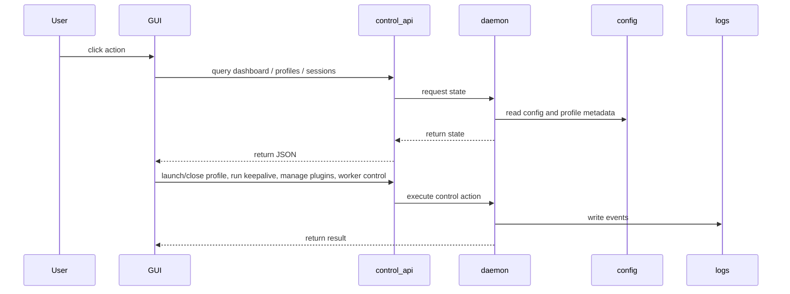

## 4. MCP 会话链路

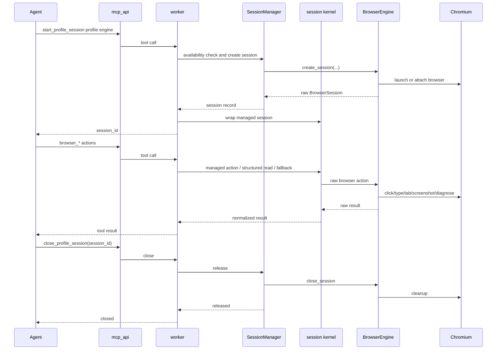

## 5. daemon automation 固定脚本链路

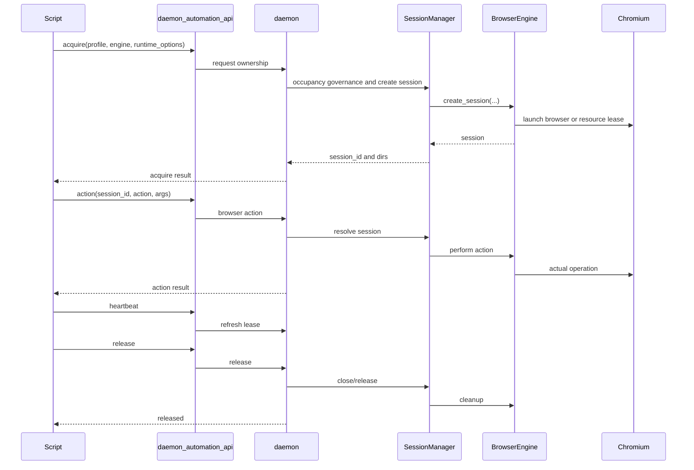

## 6. `SessionManager` 治理位置

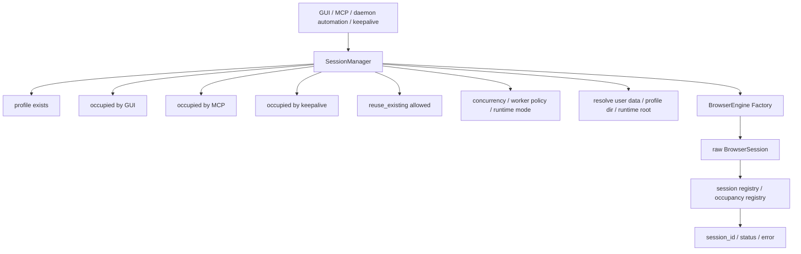

`SessionManager` 统一负责：

- profile 粒度互斥
- session 注册与释放
- 引擎选择
- runtime 路径解析
- 复用判断
- busy-state 对外表达

## 7. 浏览器引擎层

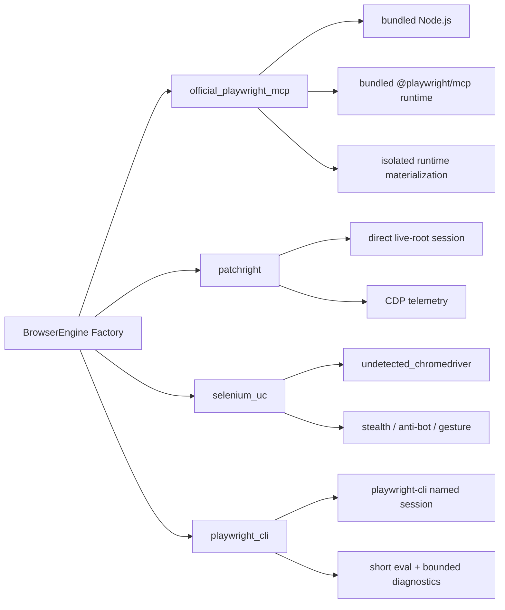

当前定位：

- `official_playwright_mcp`：默认高层主路径
- `patchright`：live-root 兼容回退
- `selenium_uc`：stealth / challenge / gesture 优先
- `playwright_cli`：轻量兼容路径

## 8. `browser_session_kernel.py` 的位置

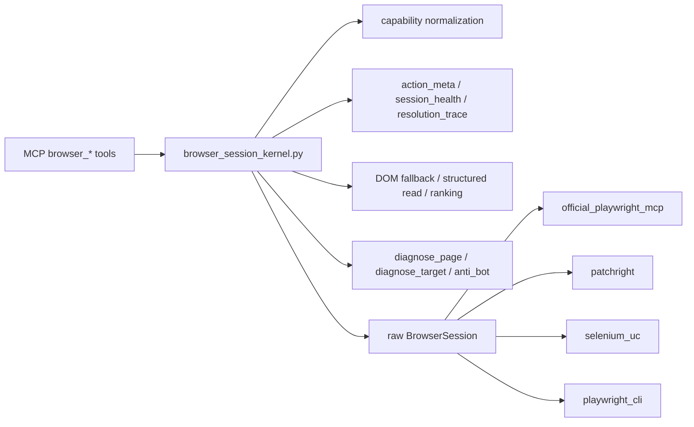

它负责把多引擎差异收敛成统一的外部工具语义。

## 8.1 Capability Kernel / Orchestrator

当前浏览器内核不再只是“统一接口后直接调原始引擎”。

新增能力层职责：

- `browser_action_registry.py`
  定义标准动作集与各引擎默认 `native_actions`
- `browser_capability_kernel.py`
  统一补齐 `capability_version=3`、`native_actions`、`preferred_paths`、`capability_kernel`
- `browser_action_orchestrator.py`
  在 managed action 执行时决定走 `native_engine` 还是 `legacy_standard`

当前原生优先能力面：

- `official_playwright_mcp`
  `get_page_text` / `get_current_url` / `get_page_html` / `get_interaction_context` / `inspect_elements` / `list_candidates` / `snapshot`
- `patchright`
  与 `official_playwright_mcp` 相同的第一批原生读能力
- `selenium_uc`
  同样接入第一批原生读能力
- `playwright_cli`
  仅对已真实实现的读动作开放原生路径：
  `get_page_text` / `get_current_url` / `get_page_html` / `get_interaction_context` / `snapshot`

结果：

- 治理层仍统一
- 调用方能力面仍统一
- 但强引擎不再被过度适配后损失能力
- 弱引擎也不会被错误声明成支持并不存在的高保真原生能力

## 9. keepalive 架构

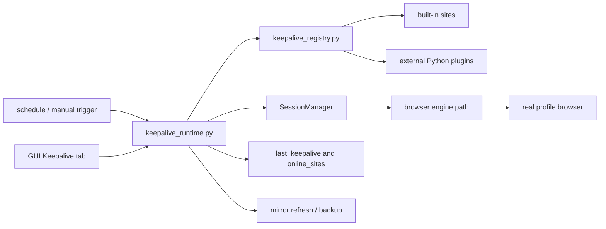

## 10. 数据与目录结构

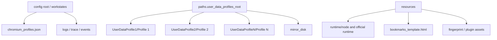

## 11. 进程模型

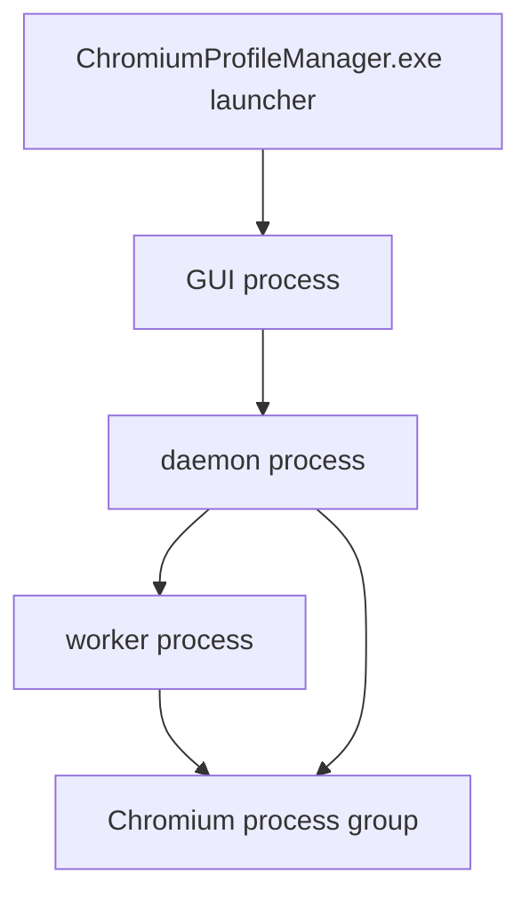

## 12. 一句话主线

主线一：

```text
GUI / MCP / Script / keepalive
    -> daemon / worker
    -> SessionManager
    -> BrowserEngine Factory
    -> specific engine
    -> real Chromium profile
```

主线二：

```text
all entrypoints must go through SessionManager before touching a real profile
```

主线三：

```text
browser_session_kernel.py is the capability-unification layer above all engines
```
